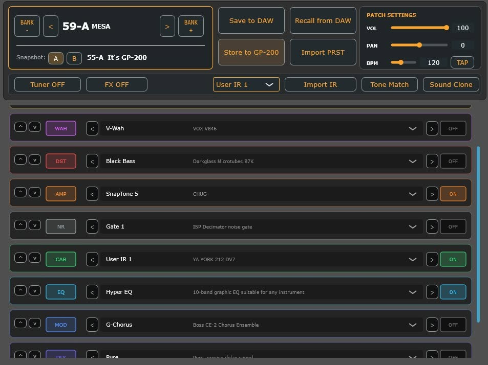
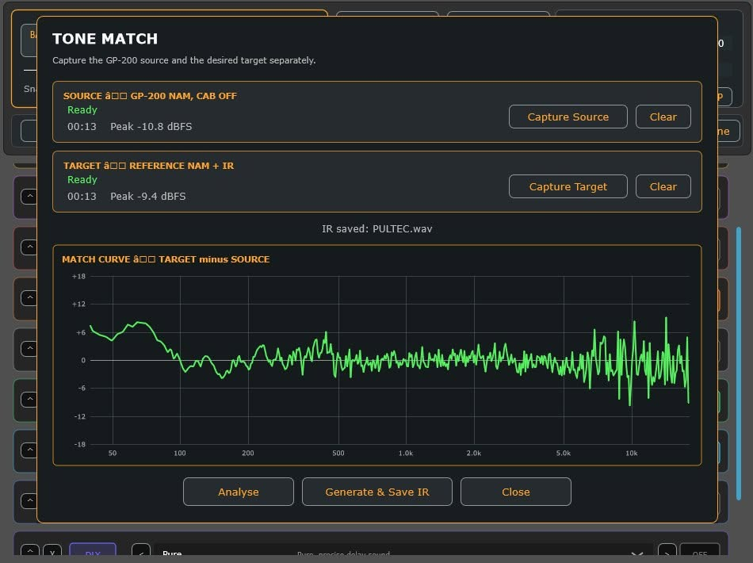
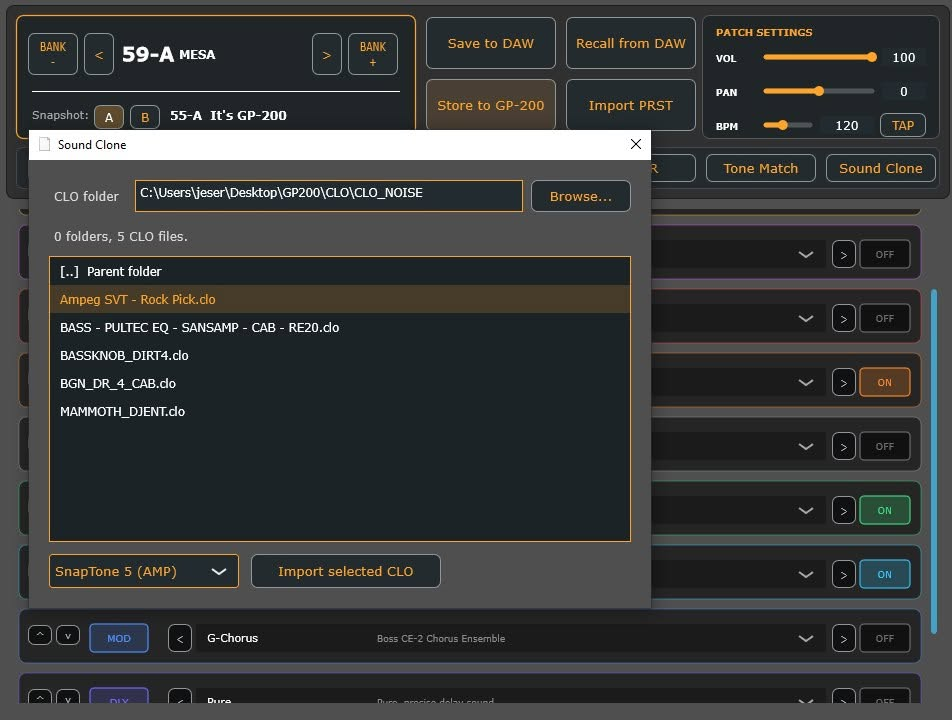

# GP200 VST

An independent open-source VST3 editor and toolkit for the **Valeton GP-200**.

GP200 VST was created to integrate the GP-200 more closely into a DAW-based workflow. It provides direct preset editing, project recall, A/B comparison, tone matching, impulse-response generation, Sound Clone management, and other tools through USB MIDI.

> **Project status:** Active development. Features and protocol support may change between releases.



## Downloads

Compiled builds are published on the GitHub **Releases** page.

The complete source code is available in this repository.

## Features

### VST3 integration

GP200 VST runs as a VST3 plug-in, allowing the GP-200 to be managed from inside a compatible DAW.

### Full preset editing

Edit the complete GP-200 signal chain, including:

- effect blocks;
- effect models;
- block on/off state;
- effect parameters;
- patch volume, pan and BPM;
- preset names and bank navigation.

### Save and recall from the DAW

The plug-in can store the current GP-200 preset state inside the DAW project and restore it later, regardless of the settings currently loaded on the hardware.

The saved state includes block configuration, selected effects and parameter values.

> **In development:** automatic restoration of User IR and Sound Clone/NAM resources when the files stored on the GP-200 differ from the resources required by the saved DAW state.

### A/B comparison

Use two internal snapshots to compare variations of the same preset without manually recreating settings.

### Integrated chromatic tuner

A real-time chromatic tuner is included directly in the plug-in interface.

### Preset and User IR import

Import GP-200 preset files and upload User IR files directly to the connected device.

## Tone Match and IR generation

GP200 VST includes a Tone Match tool based on the workflow described in *The Missing Manual for Valeton GP200* by Vincenzo Pancotti.



The typical workflow is:

1. Capture the **source** signal produced by the GP-200, for example a converted NAM/Sound Clone with its cabinet or IR section disabled.
2. Capture the **target** signal, for example the original NAM model with its intended cabinet or IR.
3. Analyse both recordings and calculate a spectral correction curve.
4. Generate a WAV impulse response that approximates the tonal difference.
5. Import the generated IR into one of the GP-200 User IR slots.

For the most consistent results:

- use the same DI performance for both captures;
- keep both signals at a similar level;
- avoid clipping;
- use recordings of approximately 15 to 30 seconds;
- disable time-based effects and other processing that may make the comparison inconsistent.

Tone Match is an approximation tool. The result depends on the source material, capture levels, model behaviour and the linearity of the difference between both signal chains.

## Sound Clone and converted NAM import

GP200 VST can import Valeton Sound Clone `.clo` files and upload them directly to the GP-200 over USB MIDI.



The Sound Clone browser provides:

- persistent library-folder selection;
- navigation through folders and subfolders;
- organization of large `.clo` collections by amplifier, creator, style or category;
- selection of any of the ten GP-200 SnapTone destinations;
- visual feedback while the model is transferred.

SnapTone destinations are divided between the two supported blocks:

- **SnapTone 1-5:** AMP block;
- **SnapTone 6-10:** DIST block.

When the official Valeton editor converts a compatible NAM model, the generated Sound Clone file is commonly stored at:

```text
C:\ProgramData\HTCache\namClo.clo
```

Copying that file before another conversion overwrites it makes it possible to build a reusable `.clo` library. These files can then be transferred again without repeating the conversion process, allowing users to maintain more converted models than the ten slots available simultaneously on the hardware.

> **Warning:** importing a Sound Clone overwrites the selected SnapTone slot. Back up any model you want to keep before replacing it.

The Sound Clone upload protocol is unofficial. It was implemented through USB MIDI traffic analysis, experiments with the official editor and testing on a physical GP-200.

## Building from source

The project is built with CMake and requires a modern C++ toolchain.

### Recommended Windows environment

- Visual Studio 2022;
- CMake;
- JUCE;
- Steinberg VST3 SDK;
- a connected Valeton GP-200 for hardware communication tests.

A typical Release build can be generated with:

```bat
cmake -S . -B build
cmake --build build --config Release
```

The exact output path depends on the CMake and JUCE configuration used by the project.

## Project origins and acknowledgements

GP200 VST was developed through research, experimentation, reverse engineering for interoperability, USB MIDI traffic analysis, hardware testing and the study of publicly available documentation and open-source projects.

The following sources and projects were especially important:

### Preset Forge / gp200editor

**phash / gp200editor**  
<https://github.com/phash/gp200editor>

This project was an essential technical reference for GP-200 interoperability, including preset structures, effect and parameter information, SysEx communication and device behaviour.

Parts of the GP200 VST interoperability layer are based on, adapted from or reimplemented using information and code from this GPL-licensed project. The corresponding attribution and licensing requirements must be preserved.

### GP-200LT SysEx research

**Dennis van Verseveld - Valeton GP-200LT SysEx**  
<https://www.reddit.com/r/ValetonGP2OO/comments/1ormsdg/valeton_gp200lt_sysex/>

This post provided useful publicly shared SysEx observations and helped compare behaviour across related GP-200 devices.

### The Missing Manual for Valeton GP200

*The Missing Manual for Valeton GP200*, by **Vincenzo Pancotti**, provided ideas and practical workflows related to NAM conversion, Tone Match and impulse-response creation.

### Official Valeton resources

Development also relied on:

- the official GP-200 user manuals and documentation;
- observation and analysis of the official Valeton editor for interoperability;
- GP-200 preset files;
- USB MIDI captures produced using hardware owned by the project author.

No official Valeton executables, firmware images, installers or proprietary editor resources should be redistributed as part of this repository.

### JUCE and Steinberg VST3 SDK

The project uses the **JUCE** application, audio, DSP, MIDI and plug-in framework, together with the **Steinberg VST3 SDK**.

- JUCE: <https://github.com/juce-framework/JUCE>
- VST3 SDK: <https://github.com/steinbergmedia/vst3sdk>

### AI-assisted development

A significant part of the implementation was developed with the assistance of **OpenAI's ChatGPT**, used as a collaborative engineering tool throughout the project.

ChatGPT assisted with:

- code generation and review;
- software architecture;
- DSP implementation;
- protocol analysis and reverse-engineering workflows;
- debugging and refactoring;
- testing strategies;
- technical documentation.

All project direction, hardware testing, design decisions, validation, integration and publication decisions were performed or supervised by the project author.

## Licensing

This repository contains components subject to different compatible open-source licences:

- original GP200 VST code that uses JUCE under its open-source terms should be distributed under **AGPL-3.0-or-later**;
- portions adapted from `phash/gp200editor` remain under **GPL-3.0-or-later**;
- the Steinberg VST3 SDK is distributed under the **MIT License**.

The exact JUCE version and the licensing option used for a release should be documented in the repository. Developers using a commercial JUCE licence may have different obligations for the original JUCE-dependent portions, while the GPL obligations of adapted `gp200editor` code still apply.

Before publishing binary releases, include the complete licence texts and third-party notices, for example:

```text
LICENSES/
├── AGPL-3.0-or-later.txt
├── GPL-3.0-or-later.txt
└── MIT-VST3.txt

THIRD_PARTY_NOTICES.md
```

This section is a technical summary of the identified licensing requirements and is not legal advice.

## Disclaimer

GP200 VST is an independent community project and is not affiliated with, endorsed by, sponsored by or officially supported by Valeton, Hotone, JUCE, Steinberg, OpenAI or their respective parent companies.

Valeton, GP-200 and all other product names and trademarks belong to their respective owners.

Use this software at your own risk. The authors and contributors are not responsible for lost presets, corrupted data, device malfunction or any other damage resulting from its use.

## Contributing

Bug reports, protocol findings, compatibility tests and code contributions are welcome.

When reporting a hardware communication issue, include:

- GP-200 model;
- firmware version;
- operating system;
- DAW and version;
- steps required to reproduce the issue;
- relevant logs or USB MIDI captures, when available and safe to share.
