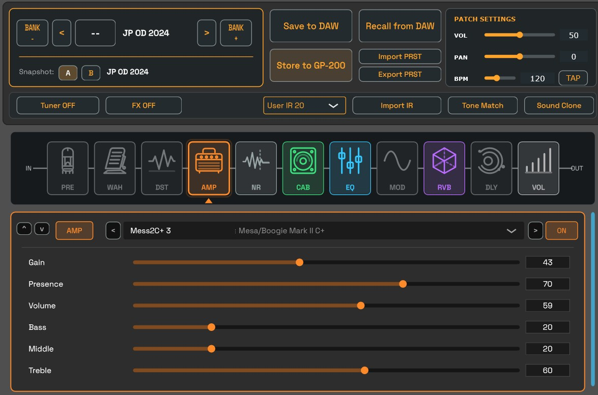
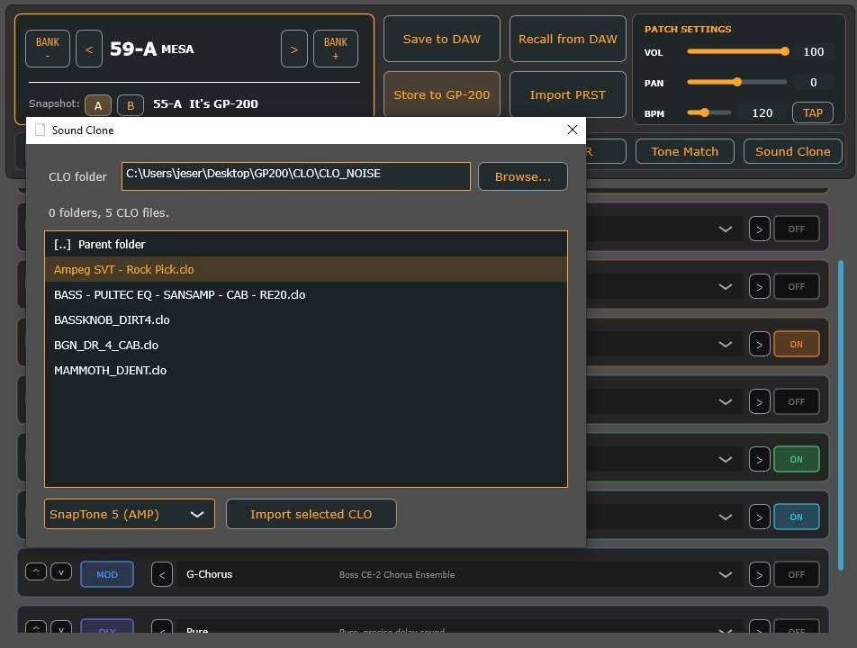
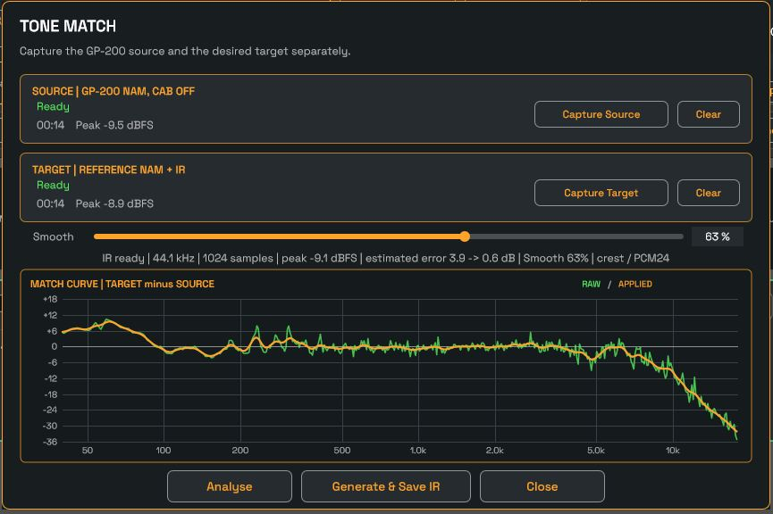

# GP200 VST Editor

A VST3 editor for the Valeton GP-200. Connect the pedal to your computer over USB MIDI to edit presets, manage IR and SnapTone libraries, use the tuner, and capture and compare audio with Tone Match.



## Features

- **Preset editing:** inspect and edit supported effect blocks, reorder the signal chain, choose models, change bypass and parameters, and adjust preset name, volume, pan, BPM, and bank or slot.
- **DAW project state and A/B:** save supported editor state with a DAW project, recall it over USB MIDI, and compare two editor snapshots.
- **Tuner:** use the integrated chromatic tuner with the audio signal routed through the plug-in.
- **User IR library:** import supported WAV impulse responses to the GP-200 User IR slots and rename stored entries. Check the destination before transfer because importing replaces its contents.
- **SnapTone Sound Clone:** browse `.clo` files, send a model to one of the ten standard SnapTone destinations (AMP 1–5 or DIST 6–10), and rename SnapTone entries. A transfer replaces the selected destination, so keep a copy of any model you want to retain.
- **Tone Match:** capture source and target audio, compare their frequency profiles, adjust the match, and render the result as a WAV impulse response.



## Tone Match workflow

1. Route the same repeatable guitar performance through the source and target chains.
2. Capture each signal in Tone Match. Keep the levels similar and avoid clipping.
3. Analyse the captures, adjust smoothing, and review the correction curve.
4. Generate and save the IR, then import it into a User IR slot and audition it in the intended preset.

Tone Match creates an approximation of the measured frequency difference. It does not recreate an amplifier or guarantee an identical sound. Results depend on the captures and on whether their differences can be represented by an impulse response.



## Sound Clone files

The editor transfers compatible Valeton `.clo` files to the GP-200's standard SnapTone destinations. To create a `.clo` model from a compatible NAM file, use Valeton's editor and then select the resulting file here. The VST does not convert arbitrary NAM models itself.

## Build from source

The build recipe below targets Windows.

### Requirements

- Windows 10 or later.
- Visual Studio 2022 with the C++ desktop development tools.
- CMake 3.22 or later.
- A JUCE source checkout.
- Python 3 to run the repository's test scripts.

**JUCE dependency:** the current source tree does not include JUCE or a recoverable pinned submodule checkout. Provide the JUCE revision selected for this project locally and pass its directory as `JUCE_SOURCE_DIR` when configuring CMake.

```bat
git clone https://github.com/Goaltoday/GP200-VST-Editor.git
cd GP200-VST-Editor
cmake -S . -B build -A x64 -DJUCE_SOURCE_DIR="C:/path/to/JUCE"
cmake --build build --config Release --parallel
```

After a successful build, locate the generated `.vst3` bundle under `build` and point your DAW's plug-in scanner to it. The exact output path depends on the CMake and JUCE build configuration.

## Tests

Run the available local regression scripts from the project root:

```bat
python tests/run_tests.py
python tests/test_receive.py
python tools/validate_catalogs.py
```

These checks do not replace building the VST3, scanning it in a DAW, or testing USB MIDI communication and audio on a GP-200.

## Data and compatibility

Connect the GP-200 using its USB MIDI ports. Back up presets, User IRs, and SnapTone models before transfers or bulk edits. Verify important changes on the pedal and listen to the result.

The build instructions document the available Windows workflow. Compatibility with a particular DAW, operating system, or device setup should be confirmed with that setup.

## License and acknowledgements

See [`LICENSE`](LICENSE) and [`THIRD_PARTY_NOTICES.md`](THIRD_PARTY_NOTICES.md) for the project's license and third-party notices. JUCE and adapted source files retain their applicable license terms.

The project builds on public GP-200 research and the `gp200editor` work by phash and its contributors. Tone Match workflows were informed by *The Missing Manual for Valeton GP200* by Vincenzo Pancotti.

- [Source repository](https://github.com/Goaltoday/GP200-VST-Editor)
- [JUCE](https://github.com/juce-framework/JUCE)
- [VST3 SDK](https://github.com/steinbergmedia/vst3sdk)
- [gp200editor](https://github.com/phash/gp200editor)
